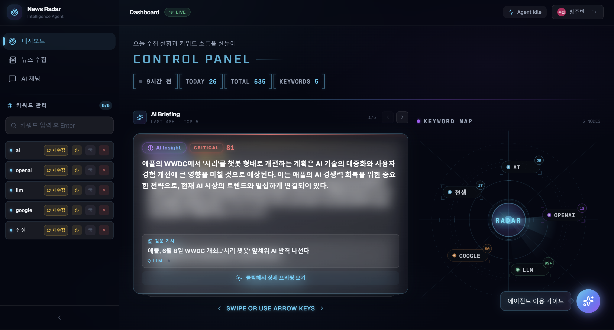
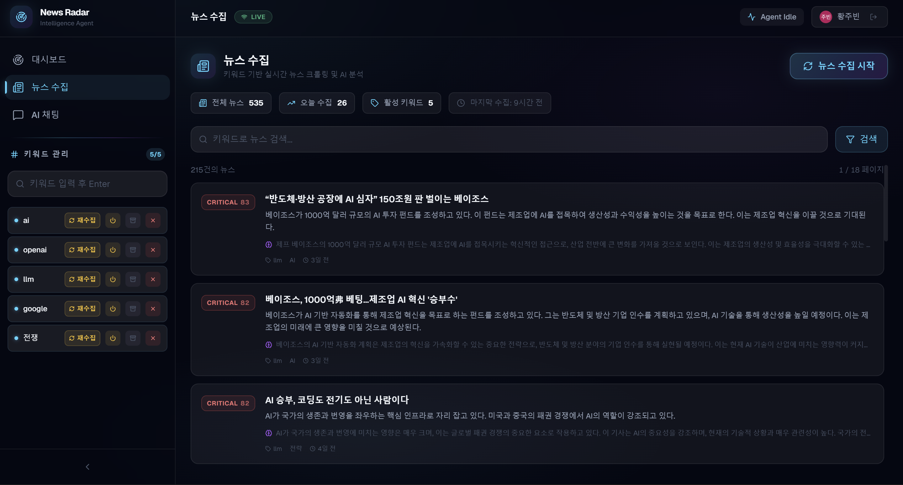
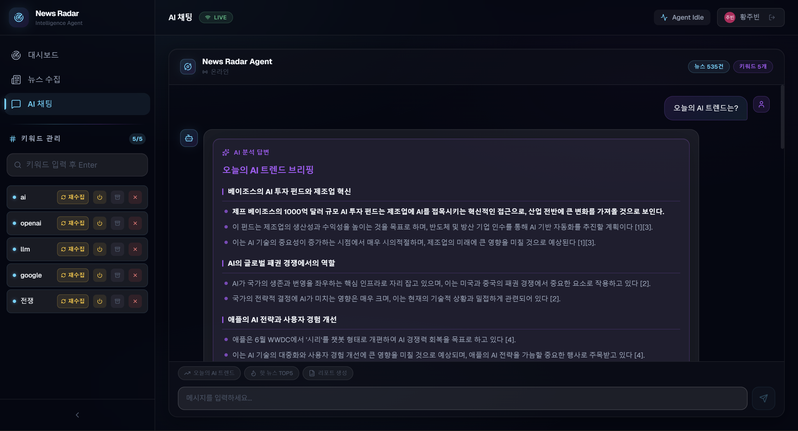

# News Radar Agent

키워드 기반 뉴스 자동 수집, AI 중요도 평가, RAG 대화형 분석을 제공하는 뉴스 큐레이션 플랫폼.

👉 [바로가기](https://news-radar-agent.vercel.app/)

| 대시보드 | 뉴스 수집 | AI 채팅 |
|:---:|:---:|:---:|
|  |  |  |

---

## 목차

1. [주요 기능](#주요-기능)
2. [기술 스택](#기술-스택)
3. [프로젝트 구조](#프로젝트-구조)
4. [아키텍처](#아키텍처)
5. [시작하기](#시작하기)
6. [배포](#배포)

---

## 주요 기능

### 뉴스 수집

- 사용자 등록 키워드 기반 네이버 뉴스 자동 크롤링 (Jsoup)
- URL 기반 중복 수집 방지
- SSE(Server-Sent Events) 기반 실시간 수집 진행률 표시
- 스케줄러를 통한 일일 자동 수집 (Asia/Seoul)

### AI 중요도 평가

- OpenAI GPT 모델을 활용한 다중 지표 평가
  - AI 점수 (0–50): 파급력, 혁신성, 시의성
  - 키워드 매칭 점수 (0–30): 제목/본문 키워드 출현도
  - 메타데이터 점수 (0–20): 출처 도메인 신뢰도
- 기사별 자동 태그 추출 (3–5개)
- 한 줄 요약 생성

### RAG 기반 대화형 Q&A

- 수집된 뉴스를 벡터 임베딩하여 시맨틱 검색 수행
- 유사도 상위 5건 기반 컨텍스트 구성 후 GPT-4o 응답 생성
- 출처 기사 링크 포함 답변 제공

### 트렌드 분석 및 리포트

- 키워드별 뉴스 트렌드 추이 시각화
- AI 기반 종합 분석 리포트 생성
- 모닝 브리핑 (중요도 70점 이상 기사 요약)

### 인증 및 사용자 관리

- NextAuth.js 기반 OAuth 로그인 (Google, GitHub)
- JWT 세션 관리
- 사용자별 키워드 및 뉴스 데이터 격리

---

## 기술 스택

### Backend

| 구분 | 기술 | 버전 |
|------|------|------|
| Framework | Spring Boot | 3.5.10 |
| Language | Java | 21 |
| Build | Gradle | 8.14.4 |
| AI | Spring AI (OpenAI) | 1.0.0 |
| Vector Store | SimpleVectorStore / PgVector | - |
| Database | H2 (개발) / PostgreSQL (운영) | - |
| Crawling | Jsoup | 1.17.2 |
| Auth | Spring Security + JWT (jjwt) | 0.12.x |

### Frontend

| 구분 | 기술 | 버전 |
|------|------|------|
| Framework | Next.js (App Router) | 16.1.6 |
| Language | TypeScript | 5.x |
| UI | React | 19.2.3 |
| Styling | Tailwind CSS | v4 |
| Animation | Framer Motion | 12.34.2 |
| AI Chat | CopilotKit | 1.51.4 |
| Auth | NextAuth.js | 4.24.13 |
| Markdown | react-markdown + remark-gfm | - |
| Icon | Lucide React | 0.574.0 |

### Infra

| 구분 | 기술 |
|------|------|
| Container | Docker, Docker Compose |
| Database (운영) | PostgreSQL 16 + pgvector |
| CI/CD | GitHub Actions → EC2 SSH 배포 |

---

## 프로젝트 구조

```
news-radar-agent/
├── backend/                          # Spring Boot API 서버
│   └── src/main/java/.../
│       ├── controller/               # REST 엔드포인트 (Auth, Chat, Keyword, News, Report, System)
│       ├── service/                  # 비즈니스 로직 (뉴스 수집, AI 평가, RAG, 태그 추출 등)
│       ├── entity/                   # JPA 엔티티 (News, Keyword, User, Role 등)
│       ├── crawler/                  # 크롤러 및 벡터 스토어
│       ├── config/                   # 설정 (Security, VectorStore, Async, Retry 등)
│       └── security/                 # JWT 인증 처리
├── frontend/                         # Next.js 웹 클라이언트
│   └── src/
│       ├── app/                      # 페이지 및 BFF API 라우트
│       │   └── api/                  # Backend 프록시 (auth, news, keywords, chat, report, system)
│       ├── components/
│       │   ├── generative/           # AI 채팅 UI (AgUiWrapper, NewsCard, RagAnswerCard 등)
│       │   ├── layout/               # 대시보드 레이아웃 (KeywordMap, MorningBriefing 등)
│       │   └── common/              # 공통 컴포넌트
│       ├── hooks/                    # 커스텀 React 훅
│       ├── lib/                      # 유틸리티
│       └── types/                    # TypeScript 타입 정의
├── docker/                           # Docker 초기화 스크립트
├── docker-compose.yml                # 운영 환경 구성 (PostgreSQL + Backend)
└── .github/workflows/deploy.yml      # CI/CD 파이프라인
```

---

## 아키텍처

### AI 모델 티어 구성

처리 목적에 따라 모델을 분리하여 비용과 품질을 최적화한다.

| 티어 | 모델 | 용도 |
|------|------|------|
| Processing | gpt-4o-mini | 배치 처리 (태그 추출, 요약, 중요도 평가) |
| Chat | gpt-4o | 사용자 대면 (RAG 응답, 트렌드 브리핑) |
| Frontend | gpt-4o (CopilotKit) | 채팅 인터페이스 |

### BFF (Backend For Frontend) 패턴

프론트엔드의 `/api/*` 라우트가 백엔드 `/api/*` 엔드포인트를 프록시한다.

```
Client → Next.js API Routes (BFF) → Spring Boot API (Port 8081)
```

### 벡터 검색 파라미터

| 항목 | 값 |
|------|-----|
| Top-K | 5 |
| Similarity Threshold | 0.30 |
| Embedding Model | text-embedding-3-small |

---

## 시작하기

### 사전 요구사항

- Java 21
- Node.js 18+
- OpenAI API Key
- (운영 환경) Docker, Docker Compose

### Backend 실행

```bash
cd backend
./gradlew bootRun
```

기본 포트: `8081` | H2 콘솔: `http://localhost:8081/h2-console`

### Frontend 실행

```bash
cd frontend
npm install
npm run dev
```

기본 포트: `3000`

---

## 배포

### Docker Compose (운영)

```bash
docker-compose up -d --build
```

PostgreSQL 16 (pgvector) + Spring Boot 컨테이너가 구성된다.
백엔드는 `pgvector` 프로파일로 기동되며, PgVector 기반 벡터 스토어를 사용한다.

### CI/CD

`main` 브랜치에 `backend/`, `docker-compose.yml`, 또는 워크플로우 파일 변경 시 GitHub Actions가 EC2에 자동 배포한다.
